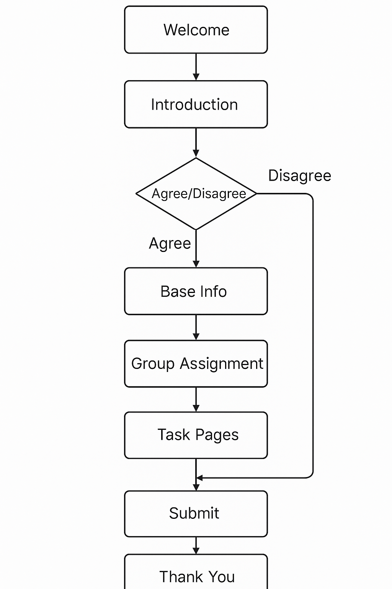
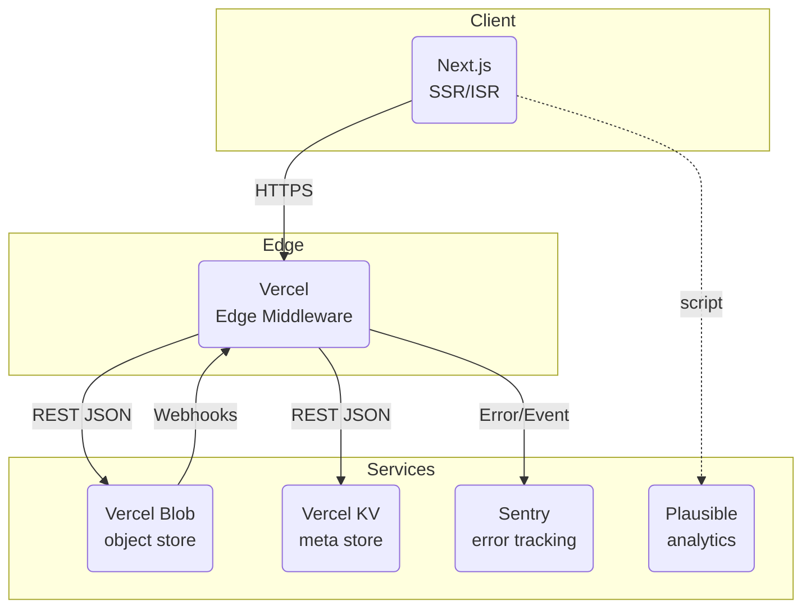

# experiment-survey-platform

## 一 Product Requirements Document（PRD）

### 1 Project Overview

An experimental web survey template designed to collect data on the effect of different systems or methods on task performance. The platform allows researchers to easily insert custom content and test questions within a pre-built structured flow.

The survey template supports controlled experiments with group assignment (control vs experimental), dynamic task difficulty adjustment, and response data collection without requiring participant login.

### 2 Project Structure/Content/Page

#### Part 1: Introduction

- Welcome page.

- Consent page (Agree/Disagree logic).

#### Part 2: Task Process

- Collect basic participant information (e.g., demographics).

- Random assignment to control or experimental group.

- Task series:

1 Experimental group: dynamic task difficulty adjustment.

2 Control group: static tasks.

3 Task submission and data storage.

#### Part 3: Completion

- Thank you page after task submission.

### 3 diagram flow

a simple diagram for survey flow please~



## 二 Technical Design Document（TDD）



### stack

#### Client:

- Next.js 15 + React 19 rendered at the edge (SSR/ISR) for speed & SEO.
- style：Tailwind CSS + ShadCN + Motion
- Form: react-hook-form
- state: Zustand

#### Edge:

- Lightweight serverless functions
- middleware enforce routing rules,
- Auth: FingerprintJS Pro (optional) ，rate-limit IPs,

#### Services:

- Vercel Blob：raw survey payloads (JSON/CSV, screenshots, files).
- Vercel KV：tiny metadata (anonymised user hash → stage, attempt count, timestamps).
- CI/CD: github actions,vercel
- Monitoring: Sentry,vercel log
- Plausible – privacy-friendly usage metrics

### Algorithms

#### Group Assignment

```
export function assignGroup(id: string): 'control' | 'experiment' {
  const hash = crypto.createHash('sha1').update(id).digest('hex');
  return parseInt(hash.slice(0, 2), 16) % 2 === 0 ? 'control' : 'experiment';
}
```

#### Dynamic Difficulty

```
export function nextDifficulty(score: number, prev: number) {
  const delta = score - prev;
  if (delta >  0.2) return 'harder';
  if (delta < -0.2) return 'easier';
  return 'same';
}
```

### Data Model

#### Vercel Blob

Token generation using vercel login and vercel link.

Secure, environment-separated storage configuration (.env.local and Vercel project variables).

```
### 安装
npm install @vercel/blob

### 生成token
vercel login

vercel link

在网页端选择 Create storage =》 Blob =》 得到token
- 本地.env.local
- vercel项目的变量
```

#### Vercel KV

### No-login Evaluation:

Participants can complete the survey without authentication.

IP address and device tracking used to limit repeated submissions.

### Route Interception:

Participants must proceed sequentially through survey pages.

Direct URL access to later steps is restricted.

### Task Countdown Timer:

Each task page includes a countdown timer to control completion time and ensure fair task timing.

## 三 UI / UX Specification

### colors

test


